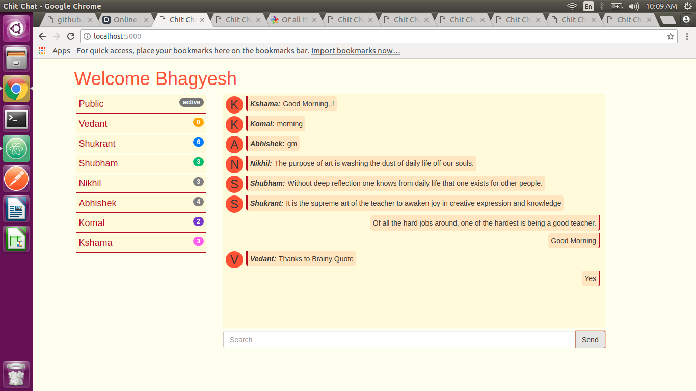
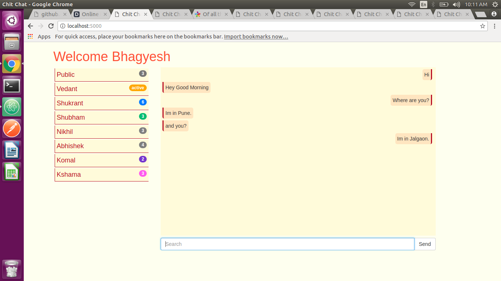

# Chit Chat App 
##### Socket Chat Application

This app is build using Socket Programming. Library used are as follow.
  - NodeJs - v8.11.4
  - Socket.IO - v2.1.1
  - Express - v4.16.3
  - Bootstrap - v3.3.7 
  - jQuery - v3.3.1

# Features!
  - You can send public message.
  - Also you can send private message to your friend.
 
### Installation
```sh
$ npm i
$ node app
```
For production environments...
```sh
$ npm install
$ NODE_ENV=production node app
```

# Below are the screenshots of the same.





# Author
 ###### [Bhagyesh Sunil Patel][1]


[//]: # (These are reference links used in the body of this note)
[1]: https://github.com/uzrnem
# socket-chat-app
